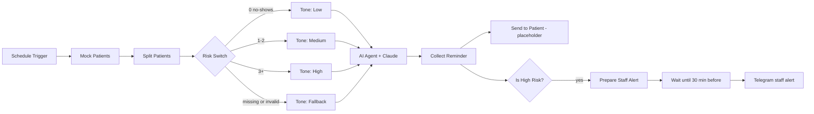

# AI Appointment No-Show Reminder

An n8n workflow that replaces one generic appointment reminder with messages whose tone and urgency scale to each patient's no-show history. High-risk patients also trigger a staff alert on Telegram so the clinic can phone them before the appointment.

> All patient data in this repository is fictional.

## The problem

Roughly 1 in 6 appointments end in a no-show, and the clinic's current reminder is a single generic text sent 24 hours out. Every patient gets the same message, whether they have never missed a visit or have missed five.

## How it works



1. A schedule trigger loads the day's patients (mock data for now).
2. A Switch node sorts each patient by past no-shows into a risk tier.
3. An Edit Fields node attaches the tone instructions for that tier.
4. An AI Agent, backed by an Anthropic chat model, writes the reminder text.
5. For high-risk patients only, a Wait node pauses until 30 minutes before the appointment, then Telegram alerts staff to phone the patient.

### Risk tiers

| Past no-shows | Tier | Reminder style |
|---|---|---|
| 0 | Low | Friendly, light and brief, with an easy way to reschedule |
| 1 to 2 | Medium | Warm but clear, asks the patient to reply YES to confirm |
| 3 or more | High | Firm, urgent and respectful, asks for CONFIRM today and offers to reschedule |
| Missing or invalid | Fallback | Neutral standard reminder |

The agent's system prompt keeps messages under 320 characters, forbids invented clinic names, phone numbers or links, and never mentions the patient's no-show history.

## Tech stack

- [n8n](https://n8n.io) for orchestration (Schedule Trigger, Switch, Edit Fields, AI Agent, Wait, Telegram)
- Anthropic Claude as the chat model
- Telegram Bot API for staff alerts

## Repository structure

```
workflow/    n8n workflow export (import this file into n8n)
screenshots/ canvas and example outputs
```

## Getting started

1. In n8n, choose **Import from file** and select `workflow/appointment-no-show-reminder.v1.json`.
2. Add an **Anthropic** credential to the *Anthropic Chat Model* node.
3. Add a **Telegram** credential to the *Staff Telegram (High Risk)* node and replace `YOUR_TELEGRAM_CHAT_ID` with your chat ID.
4. Run the workflow manually to test. Edit the dates in *Mock Patients* so appointments are in the future.

## Current limitations and roadmap

- [ ] Patient-facing send step is a placeholder; connect SMS, WhatsApp or email.
- [ ] Replace mock data with a real appointments source and filter to upcoming appointments.
- [ ] Set the schedule explicitly (for example daily at 08:00, Africa/Lagos).
- [ ] Make the staff alert lead time configurable; 30 minutes may be too late to reschedule.
- [ ] Define the risk thresholds once, instead of in both the Switch and the high-risk check.
- [ ] Add error handling and a length check on the generated message.

<!-- Add a screenshot of the workflow canvas, then uncomment:

-->
